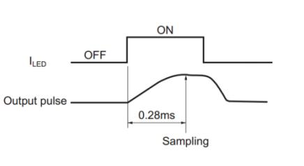
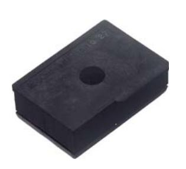
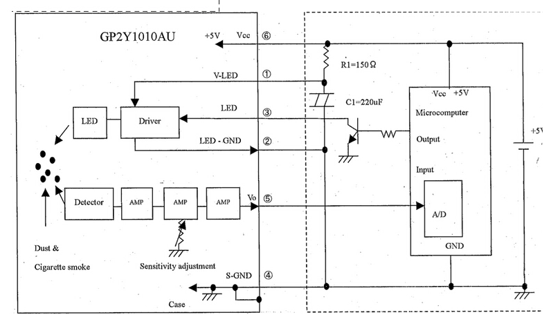
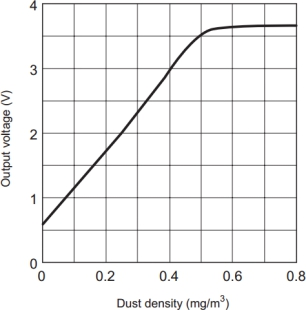
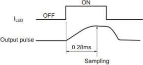
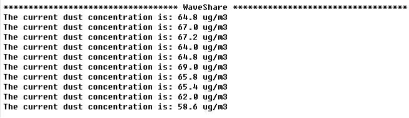

# PM2.5空气传感器
## 功能简介
检测空气中灰尘浓度，当有大量灰尘颗粒进入通气孔时，浓度发生明显变化，用于空气净化器、空气质量监测仪、PM2.5检测仪等。
## 工作原理
1) 通过设置模块 ILED 引脚为高电平，从而打开传感器内部红外二极管。  
2) 等待 0.28ms，外部控制器采样模块 AOUT 引脚的电压值。这是因为传感器内部红外二极管在开启之后 0.28ms，输出波形才达到稳定。如下图所示：  

3) 采样持续 0.04ms 之后，再设置 ILED 引脚为低电平，从而关闭内部红外二极管。  
4) 根据电压与浓度关系即可计算出当前空气中的灰尘浓度。  
PS:输出的电压经过了分压处理，要将测得的电源放大11倍才是实际传感器输出的电压。
## 实物及型号照片
### GP2Y1010AU0F

## 电路图
  

## 接线图  

| 模块 | 开发板   |
| ---- | -------- |
| VCC  | 3.3V或5V |
| GND  | GND      |
| AOUT | A0       |
| ILED | D7       |  

## 性能描述
1.关于无尘时输出电压（Vcc(V)）在没有灰尘，烟的状况下的输出电压，有规定的最大值。  
2.关于输出电压的最大电压，有规定的最小值。  
3.粉尘浓度`0.1mg/m*m*m`变化时的输出电压的变化，有规定的最小值和最大值。粉尘时根据MILD SEVEN香烟的烟做的数据。  
## 基本驱动代码  
```C
/*******************************************************************************
* Function Name  : static void _GP2Y_HardInit(void)
* Description    : Initialize Hardware
                   1. PA.6    ADC
									 2. PA.7    ILED
* Input          : None
* Output         : None
* Return         : None
* Attention		   : None
*******************************************************************************/
static void _GP2Y_HardInit(void)
{
  ADC_InitTypeDef ADC_InitStructure;
  GPIO_InitTypeDef GPIO_InitStructure;

	/*Clock enable*/
  RCC_APB2PeriphClockCmd(RCC_APB2Periph_ADC1 | RCC_APB2Periph_GPIOA | RCC_APB2Periph_AFIO, ENABLE);

  /* Configure PA.06 (ADC Channel6) as analog input -------------------------*/
  GPIO_InitStructure.GPIO_Pin = GPIO_Pin_6;
  GPIO_InitStructure.GPIO_Speed = GPIO_Speed_50MHz;
  GPIO_InitStructure.GPIO_Mode = GPIO_Mode_AIN;
  GPIO_Init(GPIOA, &GPIO_InitStructure);   
	
	/* Configure PA.07 as digital output */
  GPIO_InitStructure.GPIO_Pin = GPIO_Pin_7;
  GPIO_InitStructure.GPIO_Speed = GPIO_Speed_50MHz;
  GPIO_InitStructure.GPIO_Mode = GPIO_Mode_Out_PP;
  GPIO_Init(GPIOA, &GPIO_InitStructure); 	
	GPIO_ResetBits(GPIOA, GPIO_Pin_7);                                             //default low, ILED closed
	
    
  /* ADC1 configuration ------------------------------------------------------*/
  ADC_InitStructure.ADC_Mode = ADC_Mode_Independent;
  ADC_InitStructure.ADC_ScanConvMode = DISABLE;
  ADC_InitStructure.ADC_ContinuousConvMode = DISABLE;
  ADC_InitStructure.ADC_ExternalTrigConv = ADC_ExternalTrigConv_None;
  ADC_InitStructure.ADC_DataAlign = ADC_DataAlign_Right;
  ADC_InitStructure.ADC_NbrOfChannel = 1;
  ADC_Init(ADC1, &ADC_InitStructure);

  /* ADC1 regular channel6 configuration */ 
  ADC_RegularChannelConfig(ADC1, ADC_Channel_6, 1, ADC_SampleTime_239Cycles5);
  
  /* Enable ADC1 */
  ADC_Cmd(ADC1, ENABLE);

  /* Enable ADC1 reset calibaration register */   
  ADC_ResetCalibration(ADC1);
  /* Check the end of ADC1 reset calibration register */
  while(ADC_GetResetCalibrationStatus(ADC1));

  /* Start ADC1 calibaration */
  ADC_StartCalibration(ADC1);
  /* Check the end of ADC1 calibration */
  while(ADC_GetCalibrationStatus(ADC1));		
}
/*******************************************************************************
* Function Name  : static void _GP2Y_Wait(void)
* Description    : wait 0.28ms
* Input          : 
* Output         : None
* Return         : ADC value
* Attention		   : None
*******************************************************************************/
static void _GP2Y_Wait(void)
{
	CM3_SysTickDelayUS(280);
}
/*******************************************************************************
* Function Name  : static vu32 _GP2Y_GetADCValue(void)
* Description    : 
* Input          : 
* Output         : None
* Return         : ADC value
* Attention		   : None
*******************************************************************************/
static vu32 _GP2Y_GetADCValue(void)
{
	GPIO_SetBits(GPIOA, GPIO_Pin_7);
	_GP2Y_Wait();
	
	/*Start once cov*/
	ADC_SoftwareStartConvCmd(ADC1, ENABLE);
	while(ADC_GetFlagStatus(ADC1, ADC_FLAG_EOC) != SET)
		;
	ADC_ClearFlag(ADC1, ADC_FLAG_EOC);
	
  GPIO_ResetBits(GPIOA, GPIO_Pin_7);                                             //default low, ILED closed
	
	return _filter(ADC_GetConversionValue(ADC1));
}
/*******************************************************************************
* Function Name  : static float _GP2Y_ADCValue2Voltage(vu32 Value)
* Description    : value -> Voltage
* Input          : ADC value
* Output         : None
* Return         : voltage, unit: v
* Attention		   : None
*******************************************************************************/
static float _GP2Y_ADCValue2Voltage(vu32 Value)
{
	float Temp;
	
	Temp = (3300 / 4096.0) * Value * 11;
	
	return Temp;
}
/*******************************************************************************
* Function Name  : static float _GP2Y_DataProcess(float Voltage)
* Description    : Voltage -> Dust density
* Input          : Voltage: Sensor output voltage, unit: v
* Output         : None
* Return         : Dust density, unit: ug/m*m*m
* Attention		   : None
*******************************************************************************/
static float _GP2Y_DataProcess(float Voltage)// Êý¾ÝÖØ×é µçѹ
{
	if(Voltage >= NO_DUST_VOLTAGE)
	{
		Voltage -= NO_DUST_VOLTAGE;
		
		return (Voltage * COV_RATIO);
	}
	else
		return 0;
}
/*******************************************************************************
* Function Name  : static int _filter(int m)
* Description    : 
* Input          : 
* Output         : None
* Return         : 
* Attention		   : None
*******************************************************************************/
static int _filter(int m)
{
  static int flag_first = 0, _buff[10], sum;
  const int _buff_max = 10;
  int i;
  
  if(flag_first == 0)
  {
    flag_first = 1;

    for(i = 0, sum = 0; i < _buff_max; i++)
    {
      _buff[i] = m;
      sum += _buff[i];
    }
    return m;
  }
  else
  {
    sum -= _buff[0];
    for(i = 0; i < (_buff_max - 1); i++)
    {
      _buff[i] = _buff[i + 1];
    }
    _buff[9] = m;
    sum += _buff[9];
    
    i = sum / 10.0;
    return i;
  }
}

/*******************************************************************************
* Function Name  : void GP2Y_Init(void)
* Description    : 1. Initialize Hardware
* Input          : 
* Output         : None
* Return         : None
* Attention		   : None
*******************************************************************************/
void GP2Y_Init(void)
{
	_GP2Y_HardInit();
}
/*******************************************************************************
* Function Name  : float GP2Y_GetDensity(void)
* Description    : get density
* Input          : 
* Output         : None
* Return         : density
* Attention		   : None
*******************************************************************************/
float GP2Y_GetDensity(void)
{
	float Voltage;
	
	Voltage = _GP2Y_ADCValue2Voltage(_GP2Y_GetADCValue());
	
	Voltage = _GP2Y_DataProcess(Voltage);
	
	return Voltage;
}
```

## 产品手册
### 1.特性和原理
本模块是以夏普 GP2Y1010AU0F 为核心的灰尘传感器。传感器内部的红外二极管，可以输出一个跟灰尘浓度成线性关系的电压值。通过该电压值即可计算出空气中的灰尘和烟尘含量。  

| 测量对象：  | 直径大于 0.8μm 灰尘颗粒 |
| ---------------------- | ----------------------- |
| 有效量程：   | 500μg/m3                |
| 输出类型：   | 电压模拟量              |
| 工作电压：   | 2.5V~5.5V               |
| 产品尺寸：   | 63.2mm×41.3mm           |
| 固定孔尺寸： | 2.0mm                   |
| 通气孔尺寸： | 9.0mm                   |  

### 1.1传感器输出特性
传感器输出电压与灰尘浓度关系在 0 到 0.5mg/m3 范围内成线性关系，如下图所示：  



图 1: 传感器输出特性曲线
### 1.2传感器控制原理 
1) 通过设置模块 ILED 引脚为高电平，从而打开传感器内部红外二极管。  
2) 等待 0.28ms，外部控制器采样模块 AOUT 引脚的电压值。这是因为传感器内部红外二极管在开启之后 0.28ms，输出波形才达到稳定。如下图所示：   

图 2: ILED 与红外二极管输出波形关系
3) 采样持续 0.04ms 之后，再设置 ILED 引脚为低电平，从而关闭内部红外二极管。
4) 根据电压与浓度关系即可计算出当前空气中的灰尘浓度，具体实现细节请参考Demo 程序。
注：输出的电压经过了分压处理（[查看原理图](http://www.waveshare.net/w/upload/b/b8/Dust-Sensor-Schematic.pdf)），要将测得的电源放大 11 倍才是实际传感器输出的电压。
### 1.3主要用途
检测空气中灰尘浓度，用于空气净化器、空气质量监测仪、PM2.5 检测仪等。
### 2.操作和现象
### 2.1传感器接口说明 
| 引脚号 | 标识 | 描述                |
| ------ | ---- | ------------------- |
| 1      | VCC  | 电源正(2.5V-5.5V)   |
| 2      | GND  | 电源地              |
| 3      | AOUT | 电压模拟量输出      |
| 4      | ILED | 传感器内部 LED 驱动 |  

表 1:  传感器接口说明 
### 2.2.连接开发板使用 
下面章节以四款不同类型的开发板为例，描述具体操作步骤及实验现象。 
### 2.2.1.Open103R（主控芯片STM32F103R）
1) 编译下载 Demo 程序。  
2) 通过串口模块，把开发板 USART2 接口连接至电脑，串口调试助手设置如下：  

| 波特率 | 115200 |
| ------ | ------ |
| 数据位 | 8      |
| 停止位 | 1    |
| ------ | ---- |
| 校验位 | None |
| 流控制 | None |  

3) 传感器模块连接如下：  

| 模块 | 开发板     |
| ---- | ---------- |
| VCC  | 3.3V 或 5V |
| GND  | GND        |
| AOUT | GPIOA.6    |
| ILED | GPIOA.7    |  

表 2: 传感器和 Open103R 引脚对应关系  
4) 开发板上电，可看到串口助手不断显示当前灰尘浓度值，当有大量灰尘颗粒进入通气孔时，数据发生明显变化，实验现象见附录。
### 2.2.2. Open407Z-C（主控芯片STM32F407Z）
1) 编译下载 Demo 程序。  
2) 通过串口模块，把开发板 USART2 接口连接至电脑，串口调试助手设置如下：  

| 波特率 | 115200 |
| ------ | ------ |
| 数据位 | 8      |
| 停止位 | 1      |
| 校验位 | None   |
| 流控制 | None   |  

3) 传感器模块连接如下：  

| 模块 | 开发板     |
| ---- | ---------- |
| VCC  | 3.3V 或 5V |
| GND  | GND        |
| AOUT | GPIOA.6    |
| ILED | GPIOA.7    |  

表 3: 传感器和 Open407Z-C 引脚对应关系  
4) 开发板上电，可看到串口助手不断显示当前灰尘浓度值，当有大量灰尘颗粒进入通气孔时，数据发生明显变化，实验现象见附录。  
### 2.2.3NUCLEO-F103RB（主控芯片STM32F103R）
本开发板Demo 程序分为Mbed 及ST Library 两个版本。操作步骤及实验现象相同。
1) 编译下载 Demo 程序。  
2) 将开发板通过 USB 接口连接至电脑，串口调试助手设置如下：  

| 波特率 | 115200 |
| ------ | ------ |
| 数据位 | 8      |
| 停止位 | 1    |
| ------ | ---- |
| 校验位 | None |
| 流控制 | None |

3) 传感器模块连接如下：  

| 模块 | 开发板     |
| ---- | ---------- |
| VCC  | 3.3V 或 5V |
| GND  | GND        |
| AOUT | A0         |
| ILED | D7         |  

表 4: 传感器和 XNUCLEO-F103RB 引脚对应关系  
4) 开发板上电，可看到串口助手不断显示当前灰尘浓度值，当有大量灰尘颗粒进入通气孔时，数据发生明显变化，实验现象见附录。  
### 2.2.4Arduino UNO
1) 编译下载 Demo 程序  
2) 将开发板通过 USB 接口连接至电脑，串口调试助手设置如下：  

| 波特率 | 9600 |
| ------ | ---- |
| 数据位 | 8    |
| 停止位 | 1    |
| 校验位 | None |
| 流控制 | None |  

3) 传感器模块连接如下：  

| 模块 | 开发板     |
| ---- | ---------- |
| VCC  | 3.3V 或 5V |
| GND  | GND        |
| AOUT | A0         |
| ILED | D7         |  

表 5: 传感器和 UNO PLUS 引脚对应关系  
4) 开发板上电，可看到串口助手不断显示当前灰尘浓度值，当有大量灰尘颗粒进入通气孔时，数据发生明显变化，实验现象见附录。  
### 3.附录：
### 3.1.实验现象
串口打印灰尘浓度数据：  

  

空气污染指数分级标准如下表所示：  

| PM2.5浓度均值(μg/m3) | 空气质量AQI | 空气质量级别 | 空气质量指数类别 |
| -------------------- | ----------- | ------------ | ---------------- |
| 0-35                 | 0-50        | 一级         | 优               |
| 35-75                | 51-100      | 二级         | 良               |
| 75-115               | 101-150     | 三级         | 轻度污染         |
| 115-150              | 151-200     | 四级         | 中度污染         |
| 150-250              | 201-300     | 五级         | 重度污染         |
| 250-500              | ≥300        | 六级         | 严重污染         |  

表 6:  空气污染指数分级标准
## 作者
李毅飞
