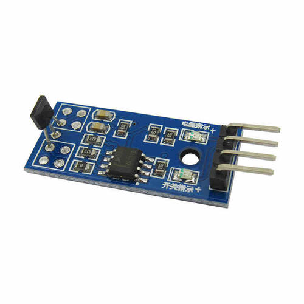

# 霍尔传感器
* [功能简介](#功能简介)
* [工作原理](#工作原理)
* [实物及型号照片](#实物及型号照片)
* [电路图、接线图](#电路图、接线图)
* [性能描述](#性能描述)
* [基本驱动代码](#基本驱动代码)
* [产品手册](#产品手册)

## 功能简介
霍尔传感器是根据霍尔效应制作的一种磁场传感器。霍尔效应是磁电效应的一种，这一现象是霍尔（A.H.Hall，1855—1938）于1879年在研究金属的导电机构时发现的。后来发现半导体、导电流体等也有这种效应，而半导体的霍尔效应比金属强得多，利用这现象制成的各种霍尔元件，广泛地应用于工业自动化技术、检测技术及信息处理等方面。
## 工作原理
简单地说，霍尔效应是指带电的导体（半导体）垂直于磁感线放置时，
在垂直于磁感线与电流方向构成的平面上产生一个电场。称为霍尔电场，相
应的电压称为霍尔电压。   
当已知导体或半导体有电流，并且装置正确放置时，磁场的有无决定了霍尔电场的有无，
磁场强度决定了霍尔电压高低，磁场越强，电压越高，磁场越弱，电压越低。    
通常，霍尔电压值很小，通常只有几个毫伏，但经集成运算放大器放大后，
就能使该电压放大到足以输出较强的信号。想了解更多细节，请参照传感器原理相关书籍。

## 实物及型号照片
### HallSensor

## 电路图、接线图
- 正极连接开发板的3.3V
- 负极连接开发板的GND
- 数据线连接开发板的IO口
## 性能描述
1. 霍尔传感器可以测量任意波形的电流和电压，如：直流、交流、脉冲波形等，甚至对瞬态峰值的测量。副边电流忠实地反应原边电流的波形。而普通互感器则是无法与其比拟的，它一般只适用于测量50Hz正弦波；
2. 原边电路与副边电路之间有良好的电气隔离，隔离电压可达9600Vrms;
3. 精度高：在工作温度区内精度优于1%，该精度适合于任何波形的测量;
4. 线性度好：优于0.1%;
5. 宽带宽：高带宽的电流传感器上升时间可小于1μs；但是，电压传感器带宽较窄，一般在15kHz以内，6400Vrms的高压电压传感器上升时间约500uS，带宽约700Hz；
6. 测量范围：霍尔传感器为系列产品，电流测量可达50KA，电压测量可达6400V。
## 基本驱动代码
```java
int main(void)
{
	Delay_Init();
	usart_Configuration();
	ADC_Configuration();
	user_gpio_init();
  	printf("\r\n****************************************************************\r\n");
  	/* Infinite loop */
  	while (1)
  	{
		if(GPIO_ReadInputDataBit(GPIOA,GPIO_Pin_4))
			printf("The Magnet is far!\r\n");
		else
			printf("The Magnet is near!\r\n");
    	/* Printf message with AD value to serial port every 1 second */
	  	AD_value = ADC_ConvertedValue;
	  	AD_value = (AD_value/4096)*3.3;
    	printf("The current Magnet AD value = %4.2fV \r\n", AD_value);
	  	Delay(100);   /* delay 1000ms */
	  }
}
```
## 产品手册
1. 产品特性
|传感器|49E霍尔传感器|
|---|---|
|电压比较器芯片|宽电压LM393|
|工作电压|2.3V-5.3V|
|产品尺寸|29.2mm*11.2mm|
|固定孔尺寸|2.0mm|

原理：49E 为小型、通用、线性霍尔效应传感器，其输出信号电平决定于施加在器件敏感面磁场强度，随磁场强度成比例的变化，当 49E处于零磁场条件时，其输出电压是电源电压的一半。

2. 主要用途 主要用于测量电机的转速，对物体的位置进行检测，智能小车和电子积木等。

3. 接口说明
|引脚号|标识|描述|
|----|----|----|
|1|DOUT|数字量输出|
|2|AOUT|模拟量输出|
|3|GND|电源地|
|4|VCC|电源正(2.3V-5.3V)|

4. 操作与现象
- 将配套程序下载到相应的开发板中。
- 将串口线和模块接入开发板，给开发板上电，打开串口调试软件。
- 把传感器靠近磁铁时，模块上的信号指示灯点亮. 传感器远离磁铁时，模块上的信号指示灯熄灭。 随着传感器与金属接触与分离，串口输出的数据会发生相应改变。
## 作者
邱嘉祺