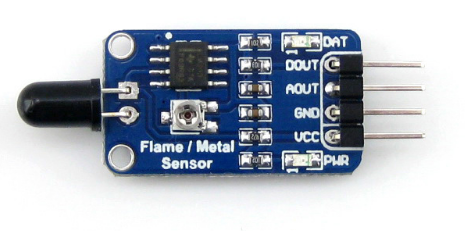
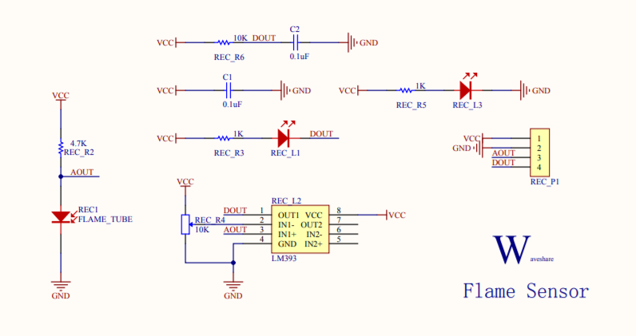
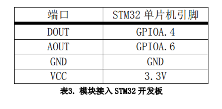
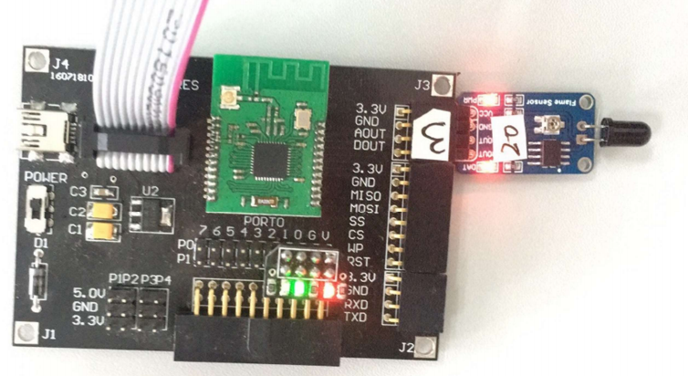
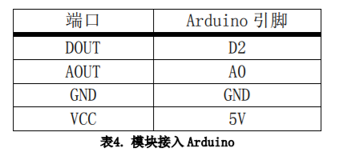
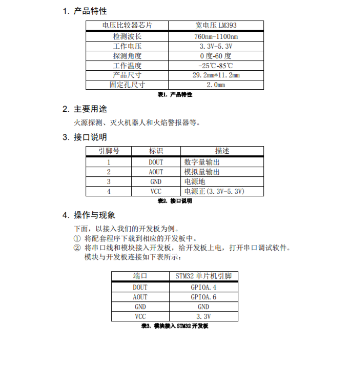
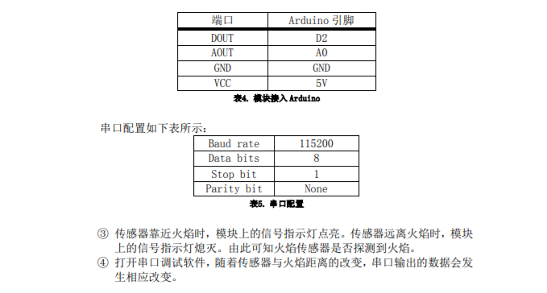

# 火焰传感器

## 目录
* [简介](#简介)
* [性能描述](#性能描述)
* [工作原理](#工作原理)
* [电路图或接线图](#电路图或接线图)
* [基本驱动代码](#基本驱动代码)
* [产品手册](#产品手册)

<a introduction="简介"></a>
## 简介

&emsp; 火焰传感器是机器人专门用来搜寻火源的传感器，当然火焰传感器也可以用来检测光线的亮度，只是本传感器对火焰特别灵敏。火焰传感器利用红外线对火焰非常敏感的特点，使用特制的红外线接受管来检测火焰。
<a performance="性能描述"></a>
## 性能描述
电压比较器芯片：	宽电压LM393<br/>
检测波长：	760nm-1100nm<br/>
工作电压：	3.3V-5.3V<br/>
探测角度：	0度-60度<br/>
工作温度：	-25℃-85℃<br/>
产品尺寸：	29.2mm*11.2mm<br/>
固定孔尺寸：	2.0mm<br/>

<a work="工作原理"></a>
## 工作原理
&emsp; 所有的燃料燃烧都辐射一定量的紫外线和大量的红外线，且光谱范围涉及红外线、可见光及紫外线。因此，整个光谱范围都可以用来检测火焰的“有”或“无”。<br/>
&emsp; 硫化铅(PbS)感测器，这是一种硫化铅光敏电阻，其特点是对红外线辐射特别敏感。燃料在燃烧时，由化学反应产生闪烁的红外线辐射，使硫化铅光敏电阻感应，转变成电信号，再经放大器处理后，输出4－20mA 或 0－10V 的模拟量。在光谱中，红外线的波长为600nm 以上，而这种硫化铅感测器的光谱灵敏度为600nm－3000nm，对绝大部分红外线辐射都可以有效采集，同时还涵盖了部分可见光中的红光，这样充分保证采集到火焰信号的真实性。

<a picture="电路图或接线图"></a>
## 电路图或接线图
### 电路图
<div align=center>

</div>

### stm32接线图
<div align=center>

</div>
接口说明<br/>
<div align=center>

</div>

### arduino接线图
<div align=center>

</div>
接口说明<br/>
<div align=center>

</div>


<a daima="基本驱动代码"></a>
### 基本驱动代码
[代码链接]()
```cpp
/* Includes ------------------------------------------------------------------*/
#include "stm32f10x.h"
#include "systick.h"
#include <stdio.h>
#include "usart.h"

/* Private define ------------------------------------------------------------*/
#define ADC1_DR_Address    ((u32)0x4001244C)

/* Private function prototypes -----------------------------------------------*/
void USART_Configuration(void);
void ADC_Configuration(void);

/* Private variables ---------------------------------------------------------*/
float AD_value;
vu16 ADC_ConvertedValue;

void user_gpio_init(void)
{
	GPIO_InitTypeDef GPIO_InitStructure;
	RCC_APB2PeriphClockCmd(RCC_APB2Periph_GPIOA,ENABLE);

	GPIO_InitStructure.GPIO_Pin=GPIO_Pin_4;
    GPIO_InitStructure.GPIO_Mode=GPIO_Mode_IPU;

	GPIO_Init(GPIOA,&GPIO_InitStructure);
}
/*******************************************************************************
* Function Name  : main
* Description    : Main program
* Input          : None
* Output         : None
* Return         : None
* Attention		 : None
*******************************************************************************/
int main(void)
{
	Delay_Init();
	usart_Configuration();
	ADC_Configuration();
	user_gpio_init();
  	printf("\r\n****************************************************************\r\n");
  	/* Infinite loop */
  	while (1)
  	{
		if(GPIO_ReadInputDataBit(GPIOA,GPIO_Pin_4))
			printf("The Flame is far!\r\n");
		else
			printf("The Flame is near!\r\n");
    	/* Printf message with AD value to serial port every 1 second */
	  	AD_value = ADC_ConvertedValue;
	  	AD_value = (AD_value/4096)*3.3;
    	printf("The current Flame AD value = %4.2fV \r\n", AD_value);
	  	Delay(100);   /* delay 1000ms */
	}
}

/*******************************************************************************
* Function Name  : ADC_Configuration
* Description    : Configure the ADC.
* Input          : None
* Output         : None
* Return         : None
* Attention		 : None
*******************************************************************************/
void ADC_Configuration(void)
{
  ADC_InitTypeDef ADC_InitStructure;
  DMA_InitTypeDef DMA_InitStructure;
  GPIO_InitTypeDef GPIO_InitStructure;

  RCC_AHBPeriphClockCmd(RCC_AHBPeriph_DMA1, ENABLE);
  RCC_APB2PeriphClockCmd(RCC_APB2Periph_ADC1 | RCC_APB2Periph_GPIOA | RCC_APB2Periph_AFIO, ENABLE);

  /* Configure PA.06 (ADC Channel6), PA.07 (ADC Channel7) as analog input -------------------------*/
  GPIO_InitStructure.GPIO_Pin = GPIO_Pin_6 | GPIO_Pin_7;
  GPIO_InitStructure.GPIO_Speed = GPIO_Speed_50MHz;
  GPIO_InitStructure.GPIO_Mode = GPIO_Mode_AIN;
  GPIO_Init(GPIOA, &GPIO_InitStructure);   
   
  /* DMA channel1 configuration ----------------------------------------------*/
  DMA_DeInit(DMA1_Channel1);
  DMA_InitStructure.DMA_PeripheralBaseAddr = ADC1_DR_Address;
  DMA_InitStructure.DMA_MemoryBaseAddr = (u32)&ADC_ConvertedValue;
  DMA_InitStructure.DMA_DIR = DMA_DIR_PeripheralSRC;
  DMA_InitStructure.DMA_BufferSize = 1;
  DMA_InitStructure.DMA_PeripheralInc = DMA_PeripheralInc_Disable;
  DMA_InitStructure.DMA_MemoryInc = DMA_MemoryInc_Disable;
  DMA_InitStructure.DMA_PeripheralDataSize = DMA_PeripheralDataSize_HalfWord;
  DMA_InitStructure.DMA_MemoryDataSize = DMA_MemoryDataSize_HalfWord;
  DMA_InitStructure.DMA_Mode = DMA_Mode_Circular;
  DMA_InitStructure.DMA_Priority = DMA_Priority_High;
  DMA_InitStructure.DMA_M2M = DMA_M2M_Disable;
  DMA_Init(DMA1_Channel1, &DMA_InitStructure);
  
  /* Enable DMA1 channel1 */
  DMA_Cmd(DMA1_Channel1, ENABLE);
    
  /* ADC1 configuration ------------------------------------------------------*/
  ADC_InitStructure.ADC_Mode = ADC_Mode_Independent;
  ADC_InitStructure.ADC_ScanConvMode = ENABLE;
  ADC_InitStructure.ADC_ContinuousConvMode = ENABLE;
  ADC_InitStructure.ADC_ExternalTrigConv = ADC_ExternalTrigConv_None;
  ADC_InitStructure.ADC_DataAlign = ADC_DataAlign_Right;
  ADC_InitStructure.ADC_NbrOfChannel = 1;
  ADC_Init(ADC1, &ADC_InitStructure);

  /* ADC1 regular channel6 configuration */ 
  ADC_RegularChannelConfig(ADC1, ADC_Channel_6, 1, ADC_SampleTime_239Cycles5);

  /* Enable ADC1 DMA */
  ADC_DMACmd(ADC1, ENABLE);
  
  /* Enable ADC1 */
  ADC_Cmd(ADC1, ENABLE);

  /* Enable ADC1 reset calibaration register */   
  ADC_ResetCalibration(ADC1);
  /* Check the end of ADC1 reset calibration register */
  while(ADC_GetResetCalibrationStatus(ADC1));

  /* Start ADC1 calibaration */
  ADC_StartCalibration(ADC1);
  /* Check the end of ADC1 calibration */
  while(ADC_GetCalibrationStatus(ADC1));
     
  /* Start ADC1 Software Conversion */ 
  ADC_SoftwareStartConvCmd(ADC1, ENABLE);
}

#ifdef  USE_FULL_ASSERT

/**
  * @brief  Reports the name of the source file and the source line number
  *   where the assert_param error has occurred.
  * @param  file: pointer to the source file name
  * @param  line: assert_param error line source number
  * @retval None
  */
void assert_failed(uint8_t* file, uint32_t line)
{ 
  /* User can add his own implementation to report the file name and line number,
     ex: printf("Wrong parameters value: file %s on line %d\r\n", file, line) */

  /* Infinite loop */
  while (1)
  {
  }
}
#endif

```


<a shouce="产品手册"></a>
### 产品手册

<div align=center>


</div>

## 作者
张杉杉