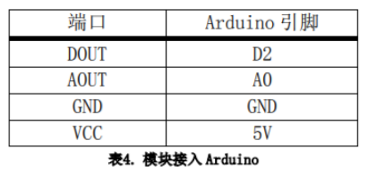
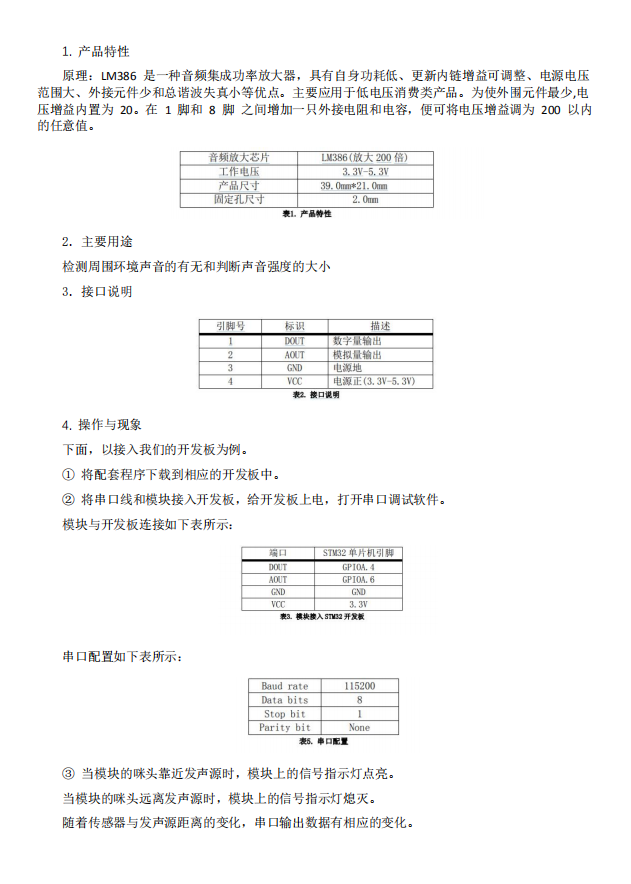

# 声音传感器

## 目录
* [简介](#简介)
* [性能描述](#性能描述)
* [工作原理](#工作原理)
* [电路图或接线图](#电路图或接线图)
* [基本驱动代码](#基本驱动代码)
* [产品手册](#产品手册)


<a introduction="简介"></a>
## 简介
声音传感器是一种将在气体，液体或固体中传播的机械振动转换为电信号的器件过装置，它用接触或非接触的方法检测出信号。声音传感器主要是指人耳可闻的声波传感器，在现实生活中主要是各种传声器。声敏传感器的种类很多，测量原理可分为压电、电致伸缩效应、电磁感应、静电效应和磁致伸缩等等。<br/>

<a performance="性能描述"></a>
## 性能描述
采用音频处理芯片LM386<br/>
对音频信号进行200倍<br/>
放大灵敏度<br/>
可调信号输出指示<br/>
用于检测周围环境声音的有无和判断声音强度的大小<br/>

<a work="工作原理"></a>
## 工作原理
本传感器内置一个对声音敏感的电容式驻极体话筒。声波使话筒内的驻极体薄膜振动，导致电容的变化，而产生与之对应变化的微小电压。这一电压随后被转化成0-5V的电压，经过A/D转换被数据采集器接受，并传送给计算机。声音传感器的作用相当于一个话筒（麦克风），它用来接收声波。驻极体检测声音大小，并经过放大电路输出模拟量。所以，检测声音的大小就与输出的模拟量成正比。<br/>

（驻极体效应。声电转换的关键元件是驻极体振动膜。它是一片极薄的塑料膜片，在其中一面蒸发上一层纯金薄膜。然后再经过高压电场驻极后，两面分别驻有异性电荷。膜片的蒸金面向外，与金属外壳相连通。膜片的另一面与金属极板之间用薄的绝缘衬圈隔离开。这样，蒸金膜与金属极板之间就形成一个电容。当驻极体膜片遇到声波振动时，引起电容两端的电场发生变化，从而产生了随声波变化而变化的交变电压。驻极体声电传感器体积小，结构简单，电声性能好，价格低廉。）<br/>

<a picture="电路图或接线图"></a>
## 电路图或接线图
### 电路图
<div align=center>

</div>

### stm32接线图
<div align=center>

</div>
接口说明<br/>
<div align=center>

</div>

### arduino接线图
<div align=center>

</div>
接口说明<br/>
<div align=center>

</div>

<a daima="基本驱动代码"></a>
### 基本驱动代码
[代码链接]()
```cpp
void ADC_Configuration(void)
{
  ADC_InitTypeDef ADC_InitStructure;
  DMA_InitTypeDef DMA_InitStructure;
  GPIO_InitTypeDef GPIO_InitStructure;

  RCC_AHBPeriphClockCmd(RCC_AHBPeriph_DMA1, ENABLE);
  RCC_APB2PeriphClockCmd(RCC_APB2Periph_ADC1 | RCC_APB2Periph_GPIOA | RCC_APB2Periph_AFIO, ENABLE);

  /* Configure PA.06 (ADC Channel6), PA.07 (ADC Channel7) as analog input -------------------------*/
  GPIO_InitStructure.GPIO_Pin = GPIO_Pin_6 | GPIO_Pin_7;
  GPIO_InitStructure.GPIO_Speed = GPIO_Speed_50MHz;
  GPIO_InitStructure.GPIO_Mode = GPIO_Mode_AIN;
  GPIO_Init(GPIOA, &GPIO_InitStructure);   
   
  /* DMA channel1 configuration ----------------------------------------------*/
  DMA_DeInit(DMA1_Channel1);
  DMA_InitStructure.DMA_PeripheralBaseAddr = ADC1_DR_Address;
  DMA_InitStructure.DMA_MemoryBaseAddr = (u32)&ADC_ConvertedValue;
  DMA_InitStructure.DMA_DIR = DMA_DIR_PeripheralSRC;
  DMA_InitStructure.DMA_BufferSize = 1;
  DMA_InitStructure.DMA_PeripheralInc = DMA_PeripheralInc_Disable;
  DMA_InitStructure.DMA_MemoryInc = DMA_MemoryInc_Disable;
  DMA_InitStructure.DMA_PeripheralDataSize = DMA_PeripheralDataSize_HalfWord;
  DMA_InitStructure.DMA_MemoryDataSize = DMA_MemoryDataSize_HalfWord;
  DMA_InitStructure.DMA_Mode = DMA_Mode_Circular;
  DMA_InitStructure.DMA_Priority = DMA_Priority_High;
  DMA_InitStructure.DMA_M2M = DMA_M2M_Disable;
  DMA_Init(DMA1_Channel1, &DMA_InitStructure);
  
  /* Enable DMA1 channel1 */
  DMA_Cmd(DMA1_Channel1, ENABLE);
    
  /* ADC1 configuration ------------------------------------------------------*/
  ADC_InitStructure.ADC_Mode = ADC_Mode_Independent;
  ADC_InitStructure.ADC_ScanConvMode = ENABLE;
  ADC_InitStructure.ADC_ContinuousConvMode = ENABLE;
  ADC_InitStructure.ADC_ExternalTrigConv = ADC_ExternalTrigConv_None;
  ADC_InitStructure.ADC_DataAlign = ADC_DataAlign_Right;
  ADC_InitStructure.ADC_NbrOfChannel = 1;
  ADC_Init(ADC1, &ADC_InitStructure);

  /* ADC1 regular channel6 configuration */ 
  ADC_RegularChannelConfig(ADC1, ADC_Channel_6, 1, ADC_SampleTime_239Cycles5);

  /* Enable ADC1 DMA */
  ADC_DMACmd(ADC1, ENABLE);
  
  /* Enable ADC1 */
  ADC_Cmd(ADC1, ENABLE);

  /* Enable ADC1 reset calibaration register */   
  ADC_ResetCalibration(ADC1);
  /* Check the end of ADC1 reset calibration register */
  while(ADC_GetResetCalibrationStatus(ADC1));

  /* Start ADC1 calibaration */
  ADC_StartCalibration(ADC1);
  /* Check the end of ADC1 calibration */
  while(ADC_GetCalibrationStatus(ADC1));
     
  /* Start ADC1 Software Conversion */ 
  ADC_SoftwareStartConvCmd(ADC1, ENABLE);
}

#ifdef  USE_FULL_ASSERT

/**
  * @brief  Reports the name of the source file and the source line number
  *   where the assert_param error has occurred.
  * @param  file: pointer to the source file name
  * @param  line: assert_param error line source number
  * @retval None
  */
void assert_failed(uint8_t* file, uint32_t line)
{ 
  /* User can add his own implementation to report the file name and line number,
     ex: printf("Wrong parameters value: file %s on line %d\r\n", file, line) */

  /* Infinite loop */
  while (1)
  {
  }
}
#endif
```


<a shouce="产品手册"></a>
### 产品手册

<div align=center>

</div>

## 作者
张杉杉


