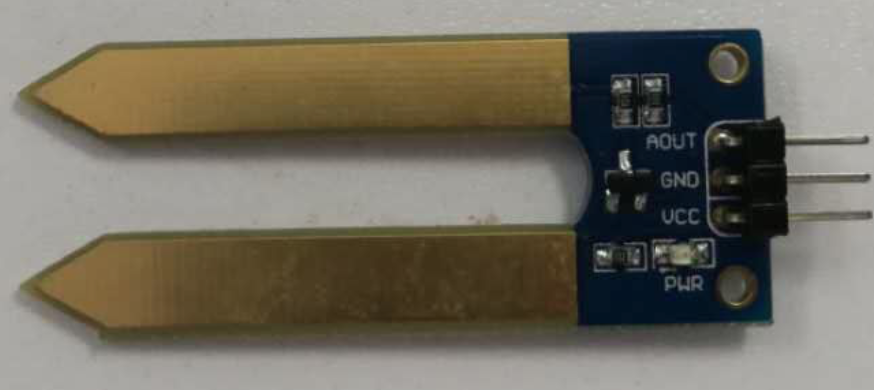
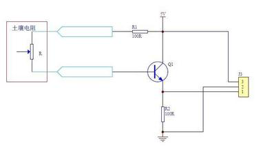
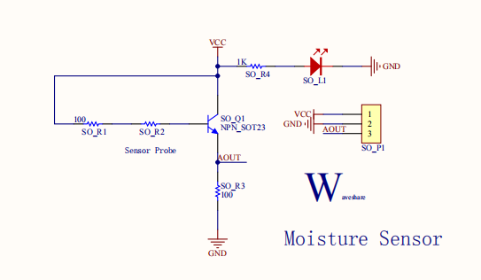
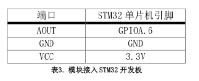
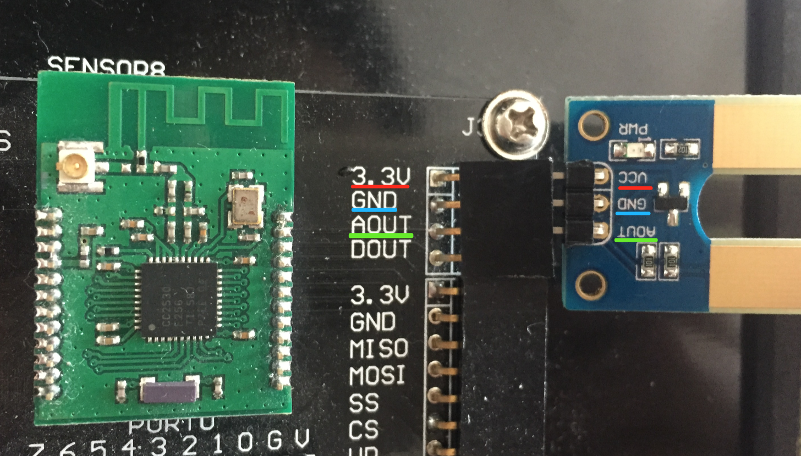
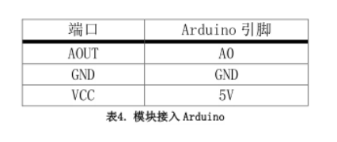
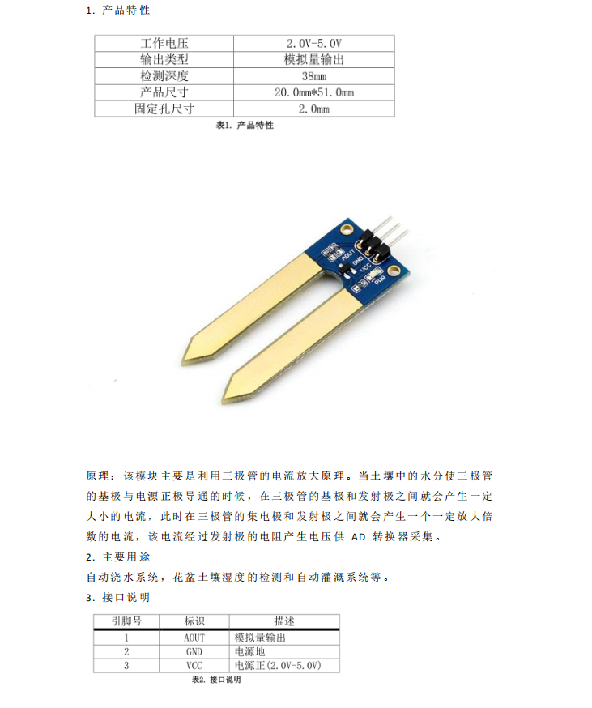
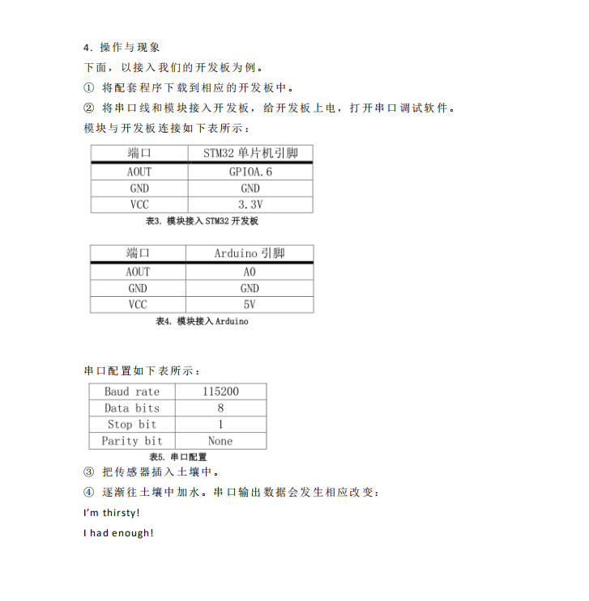

# 简易土壤湿度传感器


## 目录
* [简介](#简介)
* [性能描述](#性能描述)
* [工作原理](#工作原理)
* [电路图或接线图](#电路图或接线图)
* [基本驱动代码](#基本驱动代码)
* [产品手册](#产品手册)

<a introduction="简介"></a>
## 简介
土壤湿度传感器又名：土壤水分传感器、土壤墒情传感器、土壤含水量传感器。主要用来测量土壤容积含水量，做土壤墒情监测及农业灌溉和林业防护。<br/>

<a performance="性能描述"></a>
## 性能描述
叉形设计，方便插入土壤模块插入土壤后。<br/>
输出电压随着土壤湿度升高而增大。<br/>
可用于自动浇水系统，花盆土壤湿度的检测和自动灌溉系统等。<br/>

<a work="工作原理"></a>
## 工作原理
<div align=center>

</div>
当土壤湿度传感器探头悬空时，三极管基极处于开路状态，三极管截止输出为0；当插入土壤中时由于土壤中水分含量不同，土壤的电阻值就不同，三极管的基极就提供了大小变化的导通电流，三极管集电极到发射极的导通电流受到基极控制，经过发射极的下拉电阻后转换成电压。

<a picture="电路图或接线图"></a>
## 电路图或接线图
### 电路图
<div align=center>

</div>

### stm32接线图
<div align=center>

</div>
接口说明<br/>
<div align=center>

</div>

### arduino接线图
<div align=center>

</div>
接口说明<br/>
<div align=center>

</div>


<a daima="基本驱动代码"></a>
### 基本驱动代码
[代码链接]()
```cpp
/* Includes ------------------------------------------------------------------*/
#include "stm32f10x.h"
#include "systick.h"
#include <stdio.h>
#include "usart.h"

/* Private define ------------------------------------------------------------*/
#define ADC1_DR_Address    ((u32)0x4001244C)

/* Private function prototypes -----------------------------------------------*/
void USART_Configuration(void);
void ADC_Configuration(void);

/* Private variables ---------------------------------------------------------*/
float AD_value;
vu16 ADC_ConvertedValue;

/*******************************************************************************
* Function Name  : main
* Description    : Main program
* Input          : None
* Output         : None
* Return         : None
* Attention		 : None
*******************************************************************************/
int main(void)
{
	Delay_Init();
	usart_Configuration();
	ADC_Configuration();
  	printf("\r\n****************************************************************\r\n");
  	/* Infinite loop */
  	while (1)
  	{
    	/* Printf message with AD value to serial port every 1 second */
	  	AD_value = ADC_ConvertedValue;
	  	AD_value = (AD_value/4096)*3.3;
		if(AD_value>1.9)
			printf("I had enough!\r\n");
		else
			printf("I'm thirsty!\r\n");
	  	Delay(100);   /* delay 1000ms */
	}
}

/*******************************************************************************
* Function Name  : ADC_Configuration
* Description    : Configure the ADC.
* Input          : None
* Output         : None
* Return         : None
* Attention		 : None
*******************************************************************************/
void ADC_Configuration(void)
{
  ADC_InitTypeDef ADC_InitStructure;
  DMA_InitTypeDef DMA_InitStructure;
  GPIO_InitTypeDef GPIO_InitStructure;

  RCC_AHBPeriphClockCmd(RCC_AHBPeriph_DMA1, ENABLE);
  RCC_APB2PeriphClockCmd(RCC_APB2Periph_ADC1 | RCC_APB2Periph_GPIOA | RCC_APB2Periph_AFIO, ENABLE);

  /* Configure PA.06 (ADC Channel6), PA.07 (ADC Channel7) as analog input -------------------------*/
  GPIO_InitStructure.GPIO_Pin = GPIO_Pin_6 | GPIO_Pin_7;
  GPIO_InitStructure.GPIO_Speed = GPIO_Speed_50MHz;
  GPIO_InitStructure.GPIO_Mode = GPIO_Mode_AIN;
  GPIO_Init(GPIOA, &GPIO_InitStructure);   
   
  /* DMA channel1 configuration ----------------------------------------------*/
  DMA_DeInit(DMA1_Channel1);
  DMA_InitStructure.DMA_PeripheralBaseAddr = ADC1_DR_Address;
  DMA_InitStructure.DMA_MemoryBaseAddr = (u32)&ADC_ConvertedValue;
  DMA_InitStructure.DMA_DIR = DMA_DIR_PeripheralSRC;
  DMA_InitStructure.DMA_BufferSize = 1;
  DMA_InitStructure.DMA_PeripheralInc = DMA_PeripheralInc_Disable;
  DMA_InitStructure.DMA_MemoryInc = DMA_MemoryInc_Disable;
  DMA_InitStructure.DMA_PeripheralDataSize = DMA_PeripheralDataSize_HalfWord;
  DMA_InitStructure.DMA_MemoryDataSize = DMA_MemoryDataSize_HalfWord;
  DMA_InitStructure.DMA_Mode = DMA_Mode_Circular;
  DMA_InitStructure.DMA_Priority = DMA_Priority_High;
  DMA_InitStructure.DMA_M2M = DMA_M2M_Disable;
  DMA_Init(DMA1_Channel1, &DMA_InitStructure);
  
  /* Enable DMA1 channel1 */
  DMA_Cmd(DMA1_Channel1, ENABLE);
    
  /* ADC1 configuration ------------------------------------------------------*/
  ADC_InitStructure.ADC_Mode = ADC_Mode_Independent;
  ADC_InitStructure.ADC_ScanConvMode = ENABLE;
  ADC_InitStructure.ADC_ContinuousConvMode = ENABLE;
  ADC_InitStructure.ADC_ExternalTrigConv = ADC_ExternalTrigConv_None;
  ADC_InitStructure.ADC_DataAlign = ADC_DataAlign_Right;
  ADC_InitStructure.ADC_NbrOfChannel = 1;
  ADC_Init(ADC1, &ADC_InitStructure);

  /* ADC1 regular channel6 configuration */ 
  ADC_RegularChannelConfig(ADC1, ADC_Channel_6, 1, ADC_SampleTime_239Cycles5);

  /* Enable ADC1 DMA */
  ADC_DMACmd(ADC1, ENABLE);
  
  /* Enable ADC1 */
  ADC_Cmd(ADC1, ENABLE);

  /* Enable ADC1 reset calibaration register */   
  ADC_ResetCalibration(ADC1);
  /* Check the end of ADC1 reset calibration register */
  while(ADC_GetResetCalibrationStatus(ADC1));

  /* Start ADC1 calibaration */
  ADC_StartCalibration(ADC1);
  /* Check the end of ADC1 calibration */
  while(ADC_GetCalibrationStatus(ADC1));
     
  /* Start ADC1 Software Conversion */ 
  ADC_SoftwareStartConvCmd(ADC1, ENABLE);
}

#ifdef  USE_FULL_ASSERT

/**
  * @brief  Reports the name of the source file and the source line number
  *   where the assert_param error has occurred.
  * @param  file: pointer to the source file name
  * @param  line: assert_param error line source number
  * @retval None
  */
void assert_failed(uint8_t* file, uint32_t line)
{ 
  /* User can add his own implementation to report the file name and line number,
     ex: printf("Wrong parameters value: file %s on line %d\r\n", file, line) */

  /* Infinite loop */
  while (1)
  {
  }
}
#endif
```

<a shouce="产品手册"></a>
### 产品手册

<div align=center>


</div>

## 作者
张杉杉