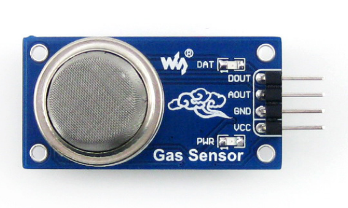
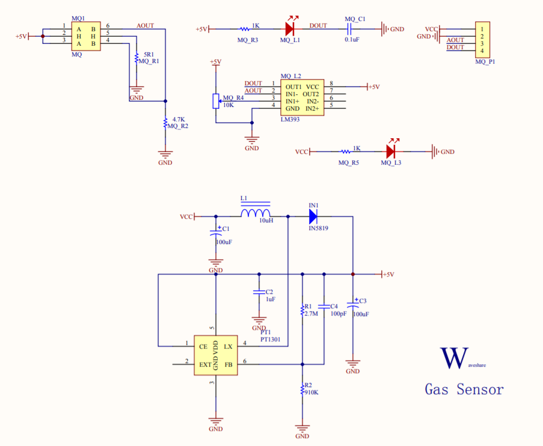
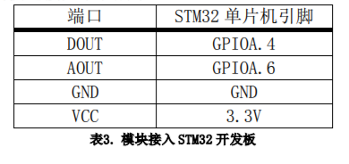
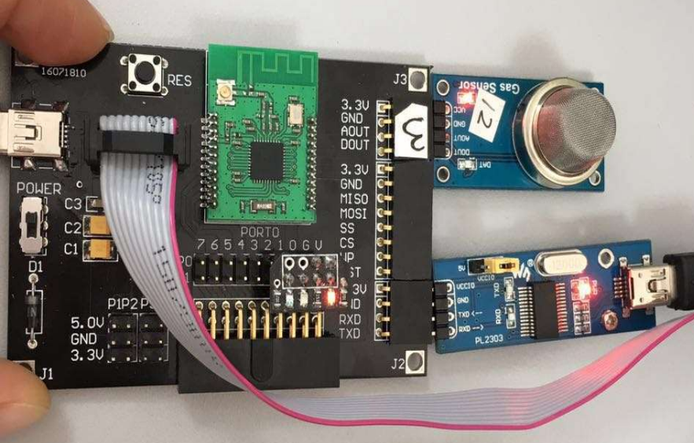
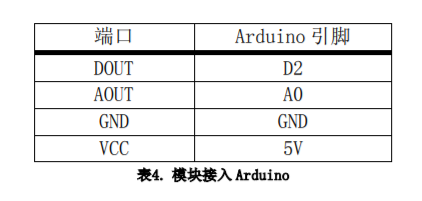
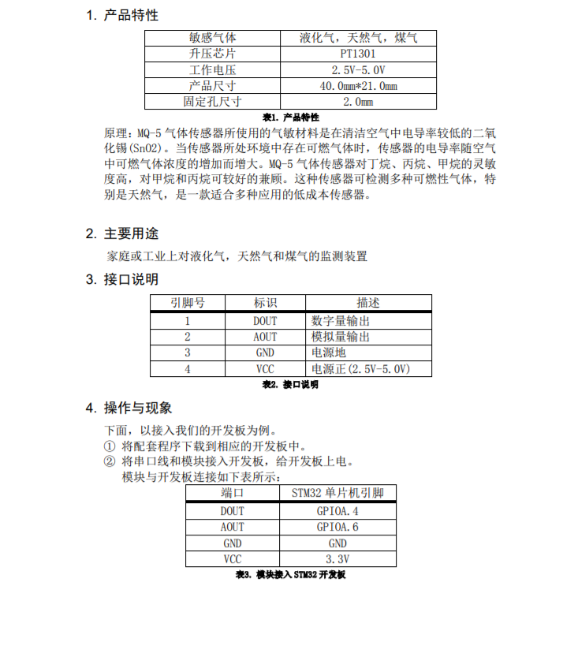
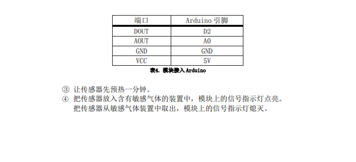

# 烟雾传感器

## 目录
* [简介](#简介)
* [性能描述](#性能描述)
* [工作原理](#工作原理)
* [电路图或接线图](#电路图或接线图)
* [基本驱动代码](#基本驱动代码)
* [产品手册](#产品手册)

<a introduction="简介"></a>
## 简介
&emsp;MQ-5 气体传感器对丁烷、丙烷、甲烷的灵敏度高，对甲烷和丙烷可较好的兼顾。这种传感
器可检测多种可燃性气体，特别是天然气，是一款适合多种应用的低成本传感器。被广泛
运用到各种消防报警系统中，性能远优于气敏电阻类的火灾报警器。

<a performance="性能描述"></a>
## 性能描述
适用于家庭或工业上对液化气、天然气和煤气的监测装置<br/>
模拟输出电压随检测环境中气体浓度的升高而增大<br/>
快速的响应恢复特性<br/>
灵敏度可调<br/>
信号输出指示<br/>

<a work="工作原理"></a>
## 工作原理
&emsp;MQ-5 气体传感器所使用的气敏材料是在清洁空气中电导率较低的二氧化锡(SnO2)。当
传感器所处环境中存在可燃气体时，传感器的电导率随空气中可燃气体浓度的增加而增大。<br/>


<a picture="电路图或接线图"></a>
## 电路图或接线图
### 电路图
<div align=center>

</div>

硬件说明：<br/>
如果周围有烟雾，烟雾传感器的“阻值”会增加，AOUT（P0_0）电平会变化，
通过比较器将模拟量转成数字量，DOUT（P0_1）输出高电平，MQ_L3 亮，否则 MQ_L3 暗，其
中电位器 MQ_R4 可以调节检测灵敏度（由于这个传感器的特殊性，MQ_R4 应该调节适当，当
没烟雾的时候 MQ_R4 不亮，有烟雾的时候 MQ_R4 亮）。<br/>

### stm32接线图
<div align=center>

</div>
接口说明<br/>
<div align=center>

</div>

### arduino接线图
<div align=center>

</div>
接口说明<br/>
<div align=center>

</div>

<a daima="基本驱动代码"></a>
### 基本驱动代码
[代码链接]()
```cpp
/* Includes ------------------------------------------------------------------*/
#include "stm32f10x.h"
#include "systick.h"
#include <stdio.h>
#include "usart.h"

/* Private define ------------------------------------------------------------*/
#define ADC1_DR_Address    ((u32)0x4001244C)

/* Private function prototypes -----------------------------------------------*/
void USART_Configuration(void);
void ADC_Configuration(void);

/* Private variables ---------------------------------------------------------*/
float AD_value;
vu16 ADC_ConvertedValue;

void user_gpio_init(void)
{
	GPIO_InitTypeDef GPIO_InitStructure;
	RCC_APB2PeriphClockCmd(RCC_APB2Periph_GPIOA,ENABLE);

	GPIO_InitStructure.GPIO_Pin=GPIO_Pin_4;
    GPIO_InitStructure.GPIO_Mode=GPIO_Mode_IPU;

	GPIO_Init(GPIOA,&GPIO_InitStructure);
}
/*******************************************************************************
* Function Name  : main
* Description    : Main program
* Input          : None
* Output         : None
* Return         : None
* Attention		 : None
*******************************************************************************/
int main(void)
{
	Delay_Init();
	usart_Configuration();
	ADC_Configuration();
	user_gpio_init();
  	printf("\r\n****************************************************************\r\n");
  	/* Infinite loop */
  	while (1)
  	{
		if(GPIO_ReadInputDataBit(GPIOA,GPIO_Pin_4))
			printf("Gas not leakage!\r\n");
		else
			printf("Gas leakage!\r\n");
    	/* Printf message with AD value to serial port every 1 second */
	  	AD_value = ADC_ConvertedValue;
	  	AD_value = (AD_value/4096)*3.3;
    	printf("The current Gas AD value = %4.2fV \r\n", AD_value);
	  	Delay(100);   /* delay 1000ms */
	}
}

/*******************************************************************************
* Function Name  : ADC_Configuration
* Description    : Configure the ADC.
* Input          : None
* Output         : None
* Return         : None
* Attention		 : None
*******************************************************************************/
void ADC_Configuration(void)
{
  ADC_InitTypeDef ADC_InitStructure;
  DMA_InitTypeDef DMA_InitStructure;
  GPIO_InitTypeDef GPIO_InitStructure;

  RCC_AHBPeriphClockCmd(RCC_AHBPeriph_DMA1, ENABLE);
  RCC_APB2PeriphClockCmd(RCC_APB2Periph_ADC1 | RCC_APB2Periph_GPIOA | RCC_APB2Periph_AFIO, ENABLE);

  /* Configure PA.06 (ADC Channel6), PA.07 (ADC Channel7) as analog input -------------------------*/
  GPIO_InitStructure.GPIO_Pin = GPIO_Pin_6 | GPIO_Pin_7;
  GPIO_InitStructure.GPIO_Speed = GPIO_Speed_50MHz;
  GPIO_InitStructure.GPIO_Mode = GPIO_Mode_AIN;
  GPIO_Init(GPIOA, &GPIO_InitStructure);   
   
  /* DMA channel1 configuration ----------------------------------------------*/
  DMA_DeInit(DMA1_Channel1);
  DMA_InitStructure.DMA_PeripheralBaseAddr = ADC1_DR_Address;
  DMA_InitStructure.DMA_MemoryBaseAddr = (u32)&ADC_ConvertedValue;
  DMA_InitStructure.DMA_DIR = DMA_DIR_PeripheralSRC;
  DMA_InitStructure.DMA_BufferSize = 1;
  DMA_InitStructure.DMA_PeripheralInc = DMA_PeripheralInc_Disable;
  DMA_InitStructure.DMA_MemoryInc = DMA_MemoryInc_Disable;
  DMA_InitStructure.DMA_PeripheralDataSize = DMA_PeripheralDataSize_HalfWord;
  DMA_InitStructure.DMA_MemoryDataSize = DMA_MemoryDataSize_HalfWord;
  DMA_InitStructure.DMA_Mode = DMA_Mode_Circular;
  DMA_InitStructure.DMA_Priority = DMA_Priority_High;
  DMA_InitStructure.DMA_M2M = DMA_M2M_Disable;
  DMA_Init(DMA1_Channel1, &DMA_InitStructure);
  
  /* Enable DMA1 channel1 */
  DMA_Cmd(DMA1_Channel1, ENABLE);
    
  /* ADC1 configuration ------------------------------------------------------*/
  ADC_InitStructure.ADC_Mode = ADC_Mode_Independent;
  ADC_InitStructure.ADC_ScanConvMode = ENABLE;
  ADC_InitStructure.ADC_ContinuousConvMode = ENABLE;
  ADC_InitStructure.ADC_ExternalTrigConv = ADC_ExternalTrigConv_None;
  ADC_InitStructure.ADC_DataAlign = ADC_DataAlign_Right;
  ADC_InitStructure.ADC_NbrOfChannel = 1;
  ADC_Init(ADC1, &ADC_InitStructure);

  /* ADC1 regular channel6 configuration */ 
  ADC_RegularChannelConfig(ADC1, ADC_Channel_6, 1, ADC_SampleTime_239Cycles5);

  /* Enable ADC1 DMA */
  ADC_DMACmd(ADC1, ENABLE);
  
  /* Enable ADC1 */
  ADC_Cmd(ADC1, ENABLE);

  /* Enable ADC1 reset calibaration register */   
  ADC_ResetCalibration(ADC1);
  /* Check the end of ADC1 reset calibration register */
  while(ADC_GetResetCalibrationStatus(ADC1));

  /* Start ADC1 calibaration */
  ADC_StartCalibration(ADC1);
  /* Check the end of ADC1 calibration */
  while(ADC_GetCalibrationStatus(ADC1));
     
  /* Start ADC1 Software Conversion */ 
  ADC_SoftwareStartConvCmd(ADC1, ENABLE);
}

#ifdef  USE_FULL_ASSERT

/**
  * @brief  Reports the name of the source file and the source line number
  *   where the assert_param error has occurred.
  * @param  file: pointer to the source file name
  * @param  line: assert_param error line source number
  * @retval None
  */
void assert_failed(uint8_t* file, uint32_t line)
{ 
  /* User can add his own implementation to report the file name and line number,
     ex: printf("Wrong parameters value: file %s on line %d\r\n", file, line) */

  /* Infinite loop */
  while (1)
  {
  }
}
#endif

```

<a shouce="产品手册"></a>
### 产品手册

<div align=center>


</div>

## 作者
张杉杉


