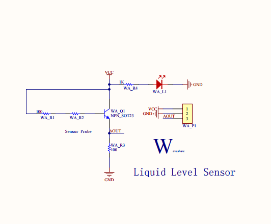
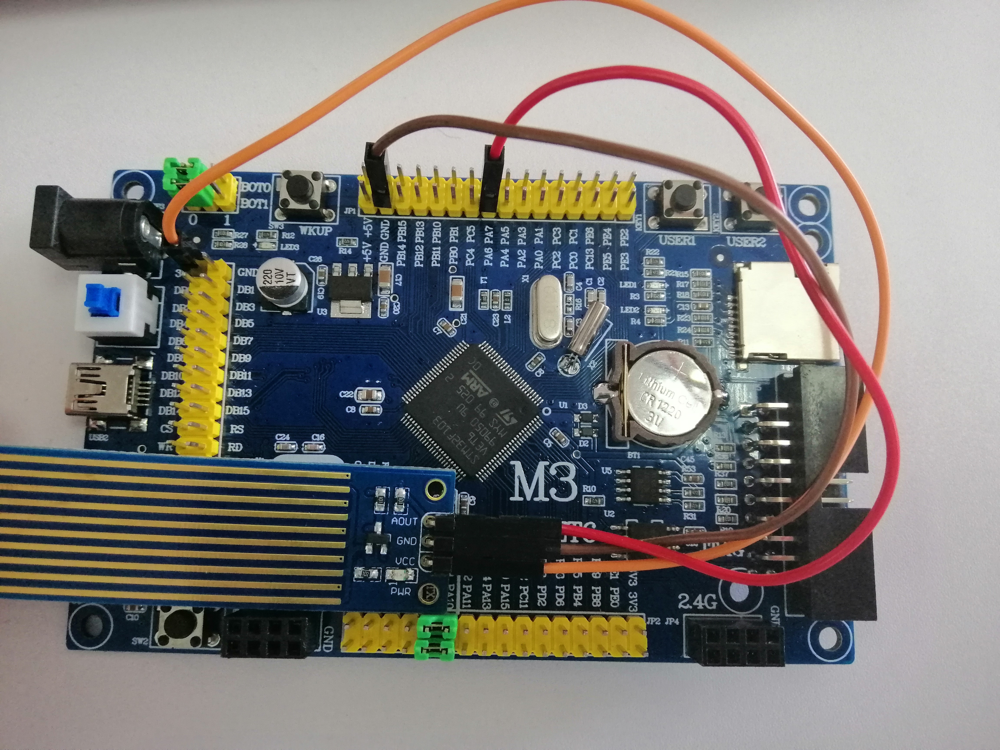
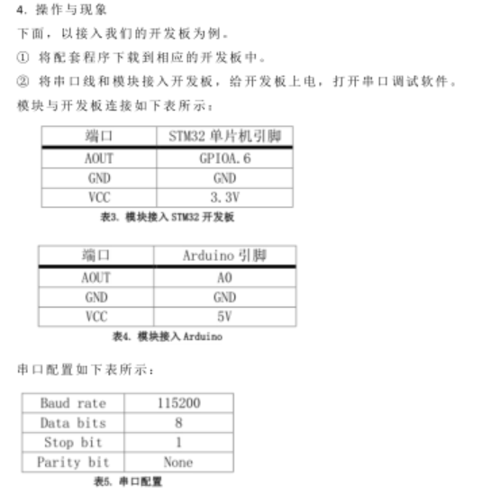
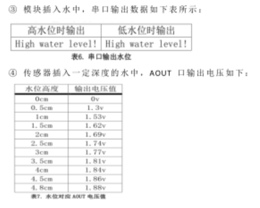

# 液位传感器
## 功能介绍
液位传感器是一种测量液位的压力传感器。</br>
根据测量出电压的大小对应出相应的高度，与自己设置的危险值比较，高出则提示高水位，低电压值则提示低水位。  
## 工作原理
静压投入式液位变送器（液位计）是基于所测液体静压与该液体的高度成比例的原理，</br>
采用国外先进的隔离型扩散硅敏感元件或陶瓷电容压力敏感传感器，将静压转换为电信号，再经过温度补偿和线性修正，</br>
利用三极管的电流放大原理，当液位高度使三极管的基极与电源正极导通的时候，在三极管的基极和发射极之间就会产生一定大小的电流，</br>
此时在三极管的集电极和发射极之间就会产生一个一定放大倍数的电流，该电流经过发射极的电阻产生电压供AD转换器采集。  
## 型号及实物照片
Liquid Level Sensor  
  
## 电路图，接线图
  
  

## 性能描述
液位传感器根据进入水的深度，输出的电压值进行改变，入水越深，电压值越大，当输出的电压值到达1.53V左右，对应的传感器入水高度在1cm左右。

## 基本驱动代码
```java
/* Private define ------------------------------------------------------------*/
#define ADC1_DR_Address    ((u32)0x4001244C)

/* Private function prototypes -----------------------------------------------*/
void USART_Configuration(void);
void ADC_Configuration(void);

/* Private variables ---------------------------------------------------------*/
float AD_value;
//ADC转换的电压值通过MDA方式传到SRAM
vu16 ADC_ConvertedValue;

/*******************************************************************************
* Function Name  : main
* Description    : Main program
* Input          : None
* Output         : None
* Return         : None
* Attention		 : None
*******************************************************************************/
int main(void)
{
	Delay_Init();
	usart_Configuration();
	ADC_Configuration();
  	printf("\r\n****************************************************************\r\n");
  	/* Infinite loop */
  	while (1)
  	{
    	/* Printf message with AD value to serial port every 1 second */
	  	AD_value = ADC_ConvertedValue;
	  	AD_value = (AD_value/4096)*3.3;
//  	if(AD_value>1.2)
//			printf("High water level!\r\n");
//		else
//			printf("Low water level!\r\n");
//	  	Delay(100);   /* delay 1000ms */   
			printf("%lf\r\n",AD_value);
	} 	
}

/*******************************************************************************
* Function Name  : ADC_Configuration
* Description    : Configure the ADC.
* Input          : None
* Output         : None
* Return         : None
* Attention		 : None
*******************************************************************************/
void ADC_Configuration(void)
{
  ADC_InitTypeDef ADC_InitStructure;
  DMA_InitTypeDef DMA_InitStructure;
  GPIO_InitTypeDef GPIO_InitStructure;

  RCC_AHBPeriphClockCmd(RCC_AHBPeriph_DMA1, ENABLE);
  RCC_APB2PeriphClockCmd(RCC_APB2Periph_ADC1 | RCC_APB2Periph_GPIOA | RCC_APB2Periph_AFIO, ENABLE);

  /* Configure PA.06 (ADC Channel6), PA.07 (ADC Channel7) as analog input -------------------------*/
  GPIO_InitStructure.GPIO_Pin = GPIO_Pin_6 | GPIO_Pin_7;
  GPIO_InitStructure.GPIO_Speed = GPIO_Speed_50MHz;
  GPIO_InitStructure.GPIO_Mode = GPIO_Mode_AIN;
  GPIO_Init(GPIOA, &GPIO_InitStructure);   
   
  /* DMA channel1 configuration ----------------------------------------------*/
  DMA_DeInit(DMA1_Channel1);//使用DMA1的通道1
  DMA_InitStructure.DMA_PeripheralBaseAddr = ADC1_DR_Address;//ADC地址
  DMA_InitStructure.DMA_MemoryBaseAddr = (u32)&ADC_ConvertedValue;//内存地址
  DMA_InitStructure.DMA_DIR = DMA_DIR_PeripheralSRC; //单向传输
  DMA_InitStructure.DMA_BufferSize = 1; //设置一个halfword
  DMA_InitStructure.DMA_PeripheralInc = DMA_PeripheralInc_Disable;//外设地址固定
  DMA_InitStructure.DMA_MemoryInc = DMA_MemoryInc_Disable;//内存地址固定
  DMA_InitStructure.DMA_PeripheralDataSize = DMA_PeripheralDataSize_HalfWord;//半字
  DMA_InitStructure.DMA_MemoryDataSize = DMA_MemoryDataSize_HalfWord; //每次访问时的数据长度
  DMA_InitStructure.DMA_Mode = DMA_Mode_Circular;//循环传输
  DMA_InitStructure.DMA_Priority = DMA_Priority_High; //优先级
  DMA_InitStructure.DMA_M2M = DMA_M2M_Disable; //2个memory变量互相访问
  DMA_Init(DMA1_Channel1, &DMA_InitStructure);
  
  /* Enable DMA1 channel1 */
  DMA_Cmd(DMA1_Channel1, ENABLE); //使能启动
    
  /* ADC1 configuration ------------------------------------------------------*/
  ADC_InitStructure.ADC_Mode = ADC_Mode_Independent;//独立ADC模式
  ADC_InitStructure.ADC_ScanConvMode = ENABLE; //扫描模式，扫描模式用于多通道采集
  ADC_InitStructure.ADC_ContinuousConvMode = ENABLE; //开启连续转换模式，不停地进行ADC转换
  ADC_InitStructure.ADC_ExternalTrigConv = ADC_ExternalTrigConv_None;//不使用外部触发转换
  ADC_InitStructure.ADC_DataAlign = ADC_DataAlign_Right;//采集数据右对称
  ADC_InitStructure.ADC_NbrOfChannel = 1; //要转换的通道数目1
  ADC_Init(ADC1, &ADC_InitStructure); 

  /* ADC1 regular channel6 configuration */ 
	//通道6为239，5个采样周期，序列为1
  ADC_RegularChannelConfig(ADC1, ADC_Channel_6, 1, ADC_SampleTime_239Cycles5);

  /* Enable ADC1 DMA */
  ADC_DMACmd(ADC1, ENABLE);
  
  /* Enable ADC1 */
  ADC_Cmd(ADC1, ENABLE);

  /* Enable ADC1 reset calibaration register  复位校准寄存器*/   
  ADC_ResetCalibration(ADC1);
  /* Check the end of ADC1 reset calibration register 等待校准寄存器复位完成*/
  while(ADC_GetResetCalibrationStatus(ADC1));

  /* Start ADC1 calibaration ADC校准*/
  ADC_StartCalibration(ADC1);
  /* Check the end of ADC1 calibration 等待校准完成*/
  while(ADC_GetCalibrationStatus(ADC1));
     
  /* Start ADC1 Software Conversion 由于没有外部触发，使用软件ADC转换*/ 
  ADC_SoftwareStartConvCmd(ADC1, ENABLE);
}

#ifdef  USE_FULL_ASSERT

/**
  * @brief  Reports the name of the source file and the source line number
  *   where the assert_param error has occurred.
  * @param  file: pointer to the source file name
  * @param  line: assert_param error line source number
  * @retval None
  */
void assert_failed(uint8_t* file, uint32_t line)
{ 
  /* User can add his own implementation to report the file name and line number,
     ex: printf("Wrong parameters value: file %s on line %d\r\n", file, line) */

  /* Infinite loop */
  while (1)
  {
  }
}
#endif
```  

<a href="Liquid Level Sensor.zip" target="_blank">完整代码</a>  

## 产品手册





## 作者
苏琪