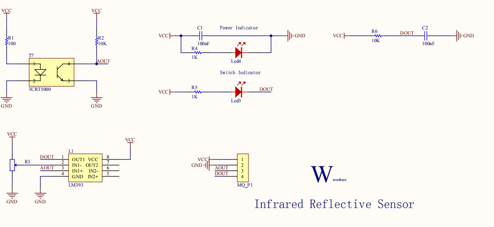
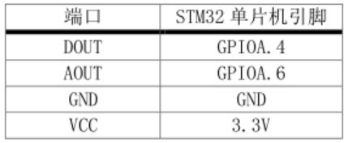

# 光传感器模块/一体红外收发模块
## 功能简介
传感器靠近障碍物时，模块上的信号指示灯点亮。  
传感器远离障碍物时，模块上的信号指示灯熄灭。  
广泛用于机器人避障、避障小车、流水线计数及黑白线循迹等。
## 工作原理
红外发射管是由红外发光二极管矩组成发光体，用红外辐射效率高的材料（常用砷化镓）制成 PN 结，正向偏压向 PN 结注入电流激发红外光，其光谱功率分布为中心波长 830-950nm。红外光的功率和电流大小有关，但正 向电流超过最大额定值时，红外光发射功率反而下降。红外接收管是将红外线光信号变成电信号的半导体器件，它的核心部件是一个特殊材料的 PN 结，和普通二极相比，在结构上采取了大的改变，目的是为了更多更大面积的接收入射光，随着红外光强度的增加电流也随之增大。
## 型号及实物照片
###  Infrared Reflective Sensor 
 ###  ST188

## 原理图、接线图


## 性能描述
1． 工作频率高，灵敏度高：采用高发射功率红外光电二极管和高灵敏度光电晶体管组成。  
2． 检测距离远：检测距离可调整范围大，4-13mm 可用。  
3． 操作方便：采用非接触检测方式。  
## 基本驱动代码
```java
/* Private function prototypes -----------------------------------------------*/
void USART_Configuration(void);
void ADC_Configuration(void);

/* Private variables ---------------------------------------------------------*/
float AD_value;
vu16 ADC_ConvertedValue;

void user_gpio_init(void)
{
	GPIO_InitTypeDef GPIO_InitStructure;
	RCC_APB2PeriphClockCmd(RCC_APB2Periph_GPIOA,ENABLE);

	GPIO_InitStructure.GPIO_Pin=GPIO_Pin_4;
    GPIO_InitStructure.GPIO_Mode=GPIO_Mode_IPU;

	GPIO_Init(GPIOA,&GPIO_InitStructure);
}
/*******************************************************************************
* Function Name  : main
* Description    : Main program
* Input          : None
* Output         : None
* Return         : None
* Attention		 : None
*******************************************************************************/
int main(void)
{
	Delay_Init();
	usart_Configuration();
	ADC_Configuration();
	user_gpio_init();
  	printf("\r\n****************************************************************\r\n");
  	/* Infinite loop */
  	while (1)
  	{
		if(GPIO_ReadInputDataBit(GPIOA,GPIO_Pin_4))
			printf("The Obstacles is far!\r\n");
		else
			printf("The Obstacles is near!\r\n");
    	/* Printf message with AD value to serial port every 1 second */
	  	AD_value = ADC_ConvertedValue;
	  	AD_value = (AD_value/4096)*3.3;
    	printf("The current Obstacles AD value = %4.2fV \r\n", AD_value);
	  	Delay(100);   /* delay 1000ms */
	}
}

/*******************************************************************************
* Function Name  : ADC_Configuration
* Description    : Configure the ADC.
* Input          : None
* Output         : None
* Return         : None
* Attention		 : None
*******************************************************************************/
void ADC_Configuration(void)
{
  ADC_InitTypeDef ADC_InitStructure;
  DMA_InitTypeDef DMA_InitStructure;
  GPIO_InitTypeDef GPIO_InitStructure;

  RCC_AHBPeriphClockCmd(RCC_AHBPeriph_DMA1, ENABLE);
  RCC_APB2PeriphClockCmd(RCC_APB2Periph_ADC1 | RCC_APB2Periph_GPIOA | RCC_APB2Periph_AFIO, ENABLE);

  /* Configure PA.06 (ADC Channel6), PA.07 (ADC Channel7) as analog input -------------------------*/
  GPIO_InitStructure.GPIO_Pin = GPIO_Pin_6 | GPIO_Pin_7;
  GPIO_InitStructure.GPIO_Speed = GPIO_Speed_50MHz;
  GPIO_InitStructure.GPIO_Mode = GPIO_Mode_AIN;
  GPIO_Init(GPIOA, &GPIO_InitStructure);   
   
  /* DMA channel1 configuration ----------------------------------------------*/
  DMA_DeInit(DMA1_Channel1);
  DMA_InitStructure.DMA_PeripheralBaseAddr = ADC1_DR_Address;
  DMA_InitStructure.DMA_MemoryBaseAddr = (u32)&ADC_ConvertedValue;
  DMA_InitStructure.DMA_DIR = DMA_DIR_PeripheralSRC;
  DMA_InitStructure.DMA_BufferSize = 1;
  DMA_InitStructure.DMA_PeripheralInc = DMA_PeripheralInc_Disable;
  DMA_InitStructure.DMA_MemoryInc = DMA_MemoryInc_Disable;
  DMA_InitStructure.DMA_PeripheralDataSize = DMA_PeripheralDataSize_HalfWord;
  DMA_InitStructure.DMA_MemoryDataSize = DMA_MemoryDataSize_HalfWord;
  DMA_InitStructure.DMA_Mode = DMA_Mode_Circular;
  DMA_InitStructure.DMA_Priority = DMA_Priority_High;
  DMA_InitStructure.DMA_M2M = DMA_M2M_Disable;
  DMA_Init(DMA1_Channel1, &DMA_InitStructure);
  
  /* Enable DMA1 channel1 */
  DMA_Cmd(DMA1_Channel1, ENABLE);
    
  /* ADC1 configuration ------------------------------------------------------*/
  ADC_InitStructure.ADC_Mode = ADC_Mode_Independent;
  ADC_InitStructure.ADC_ScanConvMode = ENABLE;
  ADC_InitStructure.ADC_ContinuousConvMode = ENABLE;
  ADC_InitStructure.ADC_ExternalTrigConv = ADC_ExternalTrigConv_None;
  ADC_InitStructure.ADC_DataAlign = ADC_DataAlign_Right;
  ADC_InitStructure.ADC_NbrOfChannel = 1;
  ADC_Init(ADC1, &ADC_InitStructure);

  /* ADC1 regular channel6 configuration */ 
  ADC_RegularChannelConfig(ADC1, ADC_Channel_6, 1, ADC_SampleTime_239Cycles5);

  /* Enable ADC1 DMA */
  ADC_DMACmd(ADC1, ENABLE);
  
  /* Enable ADC1 */
  ADC_Cmd(ADC1, ENABLE);

  /* Enable ADC1 reset calibaration register */   
  ADC_ResetCalibration(ADC1);
  /* Check the end of ADC1 reset calibration register */
  while(ADC_GetResetCalibrationStatus(ADC1));

  /* Start ADC1 calibaration */
  ADC_StartCalibration(ADC1);
  /* Check the end of ADC1 calibration */
  while(ADC_GetCalibrationStatus(ADC1));
     
  /* Start ADC1 Software Conversion */ 
  ADC_SoftwareStartConvCmd(ADC1, ENABLE);
}

#ifdef  USE_FULL_ASSERT

/**
  * @brief  Reports the name of the source file and the source line number
  *   where the assert_param error has occurred.
  * @param  file: pointer to the source file name
  * @param  line: assert_param error line source number
  * @retval None
  */
void assert_failed(uint8_t* file, uint32_t line)
{ 
  /* User can add his own implementation to report the file name and line number,
     ex: printf("Wrong parameters value: file %s on line %d\r\n", file, line) */

  /* Infinite loop */
  while (1)
  {
  }
}
#endif
```
## 产品手册
### 1.1产品描述：     
使用宽电压LM393电压比较器     
灵敏度可调     
信号输出指示     
产品参数：    
工作电压：3.0V ~ 5.3V    
产品尺寸：25mm * 15.9mm     
固定孔尺寸：2.0mm     
主要用途：    
机器人循迹、避障小车和流水线计数等    
接口说明：(以接入MCU为例)        
VCC：接3.0V ~ 5.3V   
GND：接GND   
AOUT：接MCU.IO (模拟量输出)   
DOUT：接MCU.IO (数字量输出)  


  
### 1.2 产品特性  

传感器   ST188  
电压比较器芯片   宽电压LM393  
工作电压   3.0V-5.3V  
产品尺寸   30.2mm*11.9mm  
固定孔尺寸   2.0mm  

#### 表 1. 产品特性
|传感器|ST188|
|---|---|
|电压比较器芯片|宽电压LM393|
|工作电压|3.0V-5.3V|
|产片尺寸|30.2mm*11.9mm|
|固定孔尺寸|2.0mm|  

### 1.3产品原理
红外发射管是由红外发光二极管矩组成发光体，用红外辐射效率高的材料（常用砷化镓）制成 PN 结，正向偏压向 PN 结注入电流激发红外光，其光谱功率分布为中心波长 830-950nm。红外光的功率和电流大小有关，但正向电流超过最大额定值时，红外光发射功率反而下降。红外接收管是将红外线光信号变成电信号的半导体器件，它的核心部件是一个特殊材料的 PN 结，和普通二极管相比，在结构上采取了大的改变，目的是为了更多更大面积的接收入射光，随着红外光强度的增加电流也随之增大。
### 1.4主要用途
机器人避障、避障小车、流水线计数及黑白线循迹等。
### 1.5接口说明
|引脚号|标识|描述|
|----|----|----|
|1|DOUT|数字量输出|
|2|AOUT|模拟量输出|
|3|GND|电源地|
|4|VCC|电源正（3.0V-5.3V）|   

### 操作与现象
下面，以接入我们的开发板为例。   
① 将配套程序下载到相应的开发板中。   
② 将串口线和模块接入开发板，给开发板上电，打开串口调试软件。   
模块与开发板连接如下表所示：  
 
|端口|STM32单片机引脚|
|---|---|
|DOUT|GPIOA.4|
|AOUT|GPIOA.6|
|GND|GND|
|VCC|3.3V|   

Arduino引脚连接  
 
|端口|Arduino引脚|
|---|---|
|DOUT|D2|
|AOUT|A0|
|GND|GND|
|VCC|5V|   

串口配置如下表所示：  

|Baud rate|115200|
|---|---|
|Data bits|8|
|Stop bit|1|
|Parity bit|None|   

③ 传感器靠近障碍物时，模块上的信号指示灯点亮。  
传感器远离障碍物时，模块上的信号指示灯熄灭。   
随着传感器与障碍物距离的变化，串口输出的数据会发生相应改变。
## 作者
刘馨雯