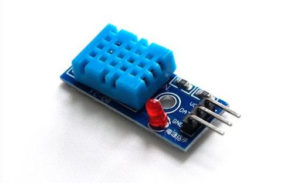
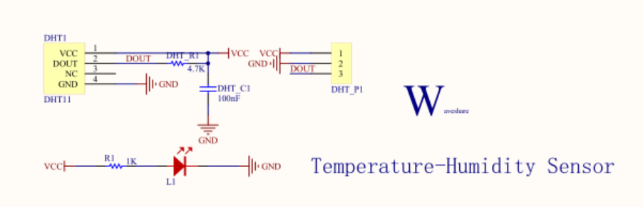
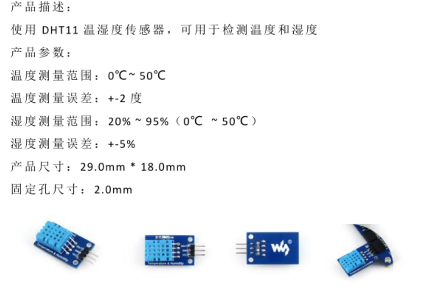
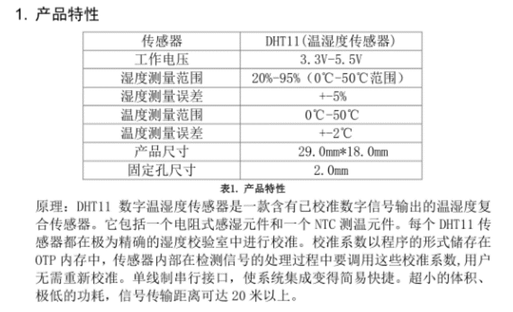
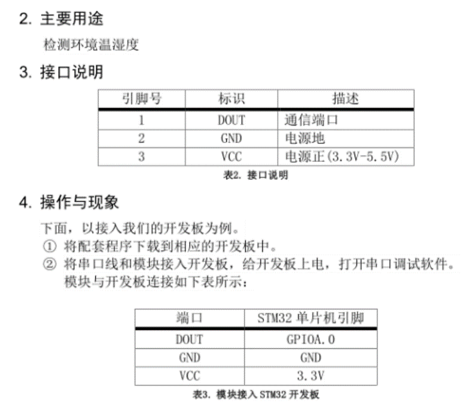
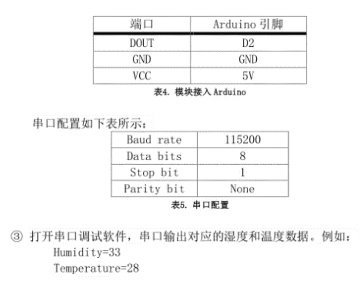

# 温湿度传感器
## 功能介绍
使用DHT11温湿度传感器，可用于检测温度和湿度
## 工作原理
传感器包括一个电阻式感湿元件和一个NTC测温元件，并与一个高性能8位单片机相连接。</br>
NTC热敏电阻、探头(金属壳或塑胶壳等，延长引线，及金属端子或连端器组成）在一定的测量功率下，电阻值随着温度上升而迅速下降。</br>
湿敏电阻式元件由感湿层，电极和具有一定强度的绝缘基片组成。感湿层在吸收了环境中的水分后引起两电极间电阻值的变化，这就相当于把湿度的变化转化成电阻值的变化。</br>
每个DHT11传感器都在极为精确的湿度校验室中进行校准。</br>
校准系数以程序的形式储存在OTP内存中，传感器内部在检测信号的处理过程中要调用这些校准系数。</br>
单线制串行接口，使系统集成变得简易快捷。超小的体积、极低的功耗，信号传输距离可达20米以上，使其成为各类应用甚至最为苛刻的应用场合的最佳选则。
## 型号及实物照片
DHT11  
  
## 电路图，接线图
  
  

## 性能描述
DHT11是一款有已校准数字信号输出的温湿度传感器。其精度湿度+-5%RH，温度+-2℃，量程湿度20-90%RH，温度0~50℃。</br>
在此传感器的测量范围内，可以测出当前的温度，湿度。

## 基本驱动代码
```java
void NVIC_Configuration(void)
{
  NVIC_InitTypeDef NVIC_InitStructure;	
  
  NVIC_SetVectorTable(NVIC_VectTab_FLASH, 0x0000);

  NVIC_PriorityGroupConfig(NVIC_PriorityGroup_1);

  NVIC_InitStructure.NVIC_IRQChannel = USART1_IRQn;
  NVIC_InitStructure.NVIC_IRQChannelPreemptionPriority = 1;
  NVIC_InitStructure.NVIC_IRQChannelSubPriority = 0;
  NVIC_InitStructure.NVIC_IRQChannelCmd = ENABLE;  
  NVIC_Init(&NVIC_InitStructure);
}

int main(void)
{
	u8 temperature;  	    
	u8 humidity; 
	SystemInit();
	usart_Configuration();	
	NVIC_Configuration();
	delay_init();
	RCC_APB2PeriphClockCmd(RCC_APB2Periph_GPIOA,ENABLE);
	printf("Waveshare!\r\n");
	while(DHT11_Init());
  	while(1)
	{
		DHT11_Read_Data(&temperature,&humidity);	
		printf("temperature=%d\r\n",temperature);
		printf("humidity=%d\r\n",humidity);
 		delay_ms(100);
	}
}
```  

<a href="Temperature-Humidity Sensor.zip" target="_blank">完整代码</a>  

## 产品手册




